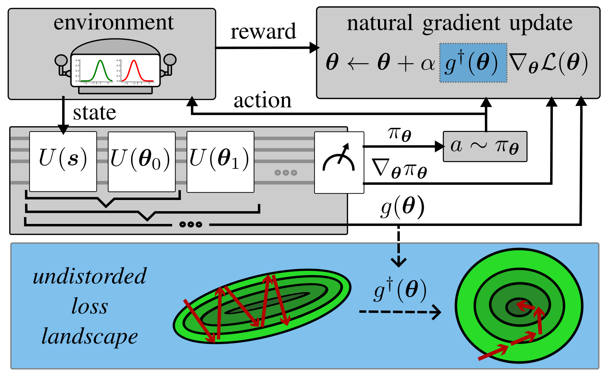
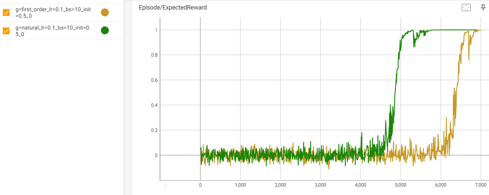

# Quantum Natural Policy Gradients
## Towards Sample-Efficient Reinforcement Learning

This is a Python toolbox that implements the methods described in ["Quantum Natural Policy Gradients: Towards Sample-Efficient Reinforcement Learning", Meyer et al., arXiv:2304.13571 (2023)](https://arxiv.org/abs/2304.13571).

**Note:** Accepted to the 1st International Workshop on Quantum Machine Learning: From Foundations to Applications (QML@QCE 2023), Bellevue, Washington, USA.



---

## Requirements

### Packages

Following packages were used to develop the toolbox (it may also work with other versions):

* ```python==3.10.10```
* ```qiskit==0.42.1```
* ```tensorboard==2.12.0```
  * only required for a nicer visualization of results

### Anaconda Environment

A ```YML``` file to create an anaconda environment for the toolbox is provided in ```environment.yml```

---

## Implemented Functionalities

### Quantum Policy Gradient Algorithm

* Formulation with raw-VQC policy
  * Proposed in "Parametrized Quantum Policies for Reinforcement Learning", Jerbi et al., NeurIPS 34 (2021).
  * Action selection based on projection to computational basis

### Action decoding Method

* Global post-processing function
  * Uses efficient construction proposed in "Quantum Policy Gradient Algorithm with Optimized Action Decoding", Meyer et al., arXiv:2212.06663 (2022).

### Quantum Policy Gradients

* Quantum Natural Gradient
  * Approximation of Quantum Fisher Information Matrix (QFIM) proposed in "Quantum Natural Gradient", Stokes et al., Quantum 4, 269 (2020).
  * Toolbox implements diagonal and block-diagonal approximation

* Second-order Quantum Natural Policy Gradient Algorithm (QNPG)
  * Proposed in "Quantum Natural Policy Gradients: Towards Sample-Efficient Reinforcement Learning", Meyer et al., arXiv:2304.13571 (2023).
  * Testing script for Contextual Bandits environments

### Accessing the Results

* Training history is automatically saved to ```results\EXP_PATH\EXP_NAME```
* A tensorboard visualization can be accessed via ```tensorboard\EXP_PATH\EXP_NAME```

---

## Usage

Navigate (```cd```) to the root of the toolbox ```qnpg```.

<details>
  <summary><b>Training</b></summary><br/>
  
  The training can be started via ```main.py```

The script provides the following options:

  ```
main.py [-h] [--gradient {first_order,natural}] [--spsa]
               [--qfi_approximation {diag,block_diag}] [--num_qubits N]
               [--shots N] [--shots_grad N] [--learning_rate F]
               [--initializer F] [--initializer_seed N] [--batch_size N]
               [--episodes N] [--validation_interval N]
               [--validation_samples N] [--path PATH]
               [--experiment_suffix EXPERIMENT_SUFFIX]
```

  Detailed information and options can be obtained by:
  ```
  python3 main.py -h
  ```

The training progress is prompted to the commandline during training and saved to ```results``` afterwards.

</details>

<details>
  <summary><b>Recreating our Results</b></summary><br/>

The main part of our work employs the QNPG algorithm on a 12-qubit system:

* In order to train a model with first-order gradients, one can run:
  ```
  python main.py --gradient=first_order --num_qubits=12 --episodes=5000 --validation_interval=10 --validaqtion_samples=256
  ```  
  
* In order to train a model with first-order gradients, one can run:
  ```
  python main.py --gradient=natural --num_qubits=12 --episodes=5000 --validation_interval=10 --validaqtion_samples=256
  ```

As the performance is very much dependent on the parameter initialization, results can deviate. In the paper, we averaged the performance over several different initializations to create the plots.

A performance close to the plot below can be expected for ```--initializer=0.5 --initializer_seed=0```:



</details>

<details>
  <summary><b>Displaying Results</b></summary><br/>

Results are saved to a dictionary with an auto-generated path of the form ```tensorboard/EXP_PATH/EXP_NAME```.

The result of a specific experiment can be visualized via:
  ```
  tensorboard --logdir tensorboard/EXP_PATH/EXP_NAME
  ```

Different experimental results can be compared with:
  ```
  tensorboard --logdir tensorboard/EXP_PATH
  ```

</details>

---
# Citation

If you use this code or results in your paper, please cite our work as

```
@article{meyer2023quantum,
  title={Quantum Natural Policy Gradients: Towards Sample-Efficient Reinforcement Learning},
  author={Meyer, Nico and Scherer, Daniel D. and Plinge, Axel and Mutschler, Christopher
  and Hartmann, Michael J.},
  journal={2023 IEEE International Conference on Quantum Computing and Engineering (QCE)},
  volume={2},
  pages={36--41},
  year={2023},
  doi={10.1109/QCE57702.2023.10181}
}
```

**Note:** Reference will be updated once published by IEEE